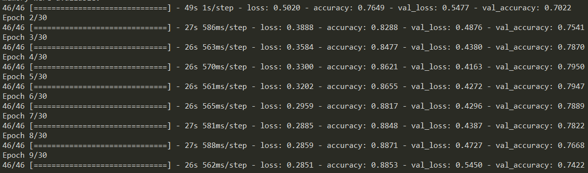

# Eye 학습 결과

# 1. Not_saved.h5

## Info

- Data: ver3-2 - LDH, LJW, HYJ, LSH, KSG, JHW, UTH
    - 약 24,000장
    - train: 0.8, valid: 0.2
    - batch = 128
    - shuffle = True
- Augmentation:
    - Resize(224), Resclae(/255.0)  # Aug라기에는..?
    - RandomHorizontalFlip
    - RandomBrightness(max_delta=0.15)
    - RandomContrast(0.7, 1.3)
    - RandomHue(0.05) # 색조
    - RandomSaturation(0.7, 2.0) # 채도
    - GaussianNoise(0.08)
- Model: MobileNetV2
    - weights: pre-trained with Imagenet
        - train layers: fc = 1 (trainable parameter 1281)
- Compile:
    - optim = Adam(lr=0.001)
    - loss = Binary crossentropy
- Pipeline:
    1. load data, batch, shuffle, train_valid_split, seed=112
    2. cache
    3. augmentation
    4. prefetch
    5. train
- Train:
    - epochs = 30
    - early_stop: patience = 5

## Result

Prediction:

- prediction with unseen data(seen person)
- prediction with unseen data(unseen person)

    

## Knowledge?

- 100*100으로 바꿔서 스크래치 해보기
    - 해보니 train 정확도는 계속 올라가는데 vaild는 0.5 그대로다.

        → 얼굴, 눈 pre-trained 모델 잘 찾으면 valid 정확도 훨씬 올라가겠다. 

        얼굴이나 눈이나 imagenet weight를 사용하면train 정확도만 계속 올라가고 vaild는 어느 정도 선에서 한계가 있었다.
